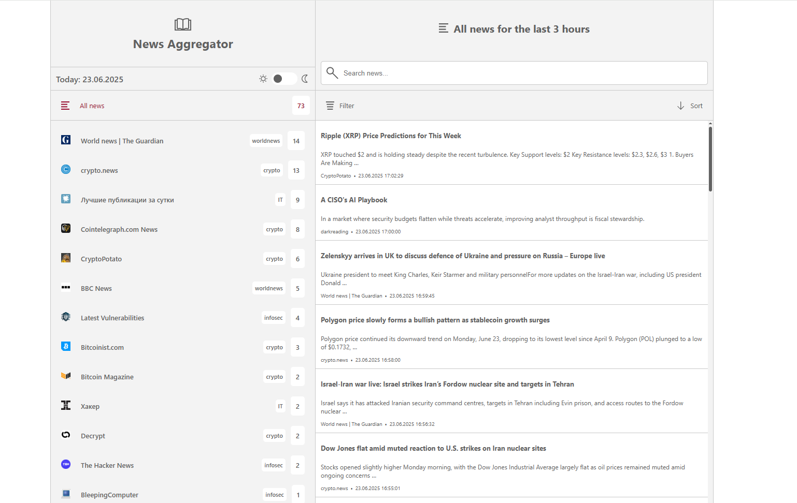

# News Aggregator

A simple news aggregator built with Go that fetches news from various RSS and ATOM feeds, processes them, and displays the latest news in a user-friendly web interface. The application supports light and dark themes and is optimized for desktop and mobile devices.

## Features

### Implemented
- Responsive UI with support for desktops, tablets, and mobile devices.
- Light and dark themes.
- Support for RSS and ATOM feeds.

### Planned
- Main screen with customizable widgets.
- Full-fledged desktop applications for Windows and Linux.
- Support for additional feed formats.

## Screenshots

### Light Theme


### Dark Theme


## Prerequisites

Before you begin, ensure you have the following installed:

- [Go](https://golang.org/dl/) (version 1.21 or later)
- A web browser

## Getting Started

Follow these steps to set up and run the project locally.

### 1. Clone the Repository

Clone the repository to your local machine using the following command:

```bash
git clone https://github.com/rcnow/news-aggregator.git
```

### 2. Navigate to the Project Directory

Change into the project directory:

```bash
cd news-aggregator
```

### 3. Add Your Feed Links

Open the `handlers.go` file and add your RSS feed URLs to the `feeds` slice. For example:

```go
feeds := []string{
    "https://cointelegraph.com/rss", // Example one
    "https://bitcoinmagazine.com/feed", // Example two
    "https://example.com/feed", // Add your custom feed here
}
```

### 4. Run the Application

Start the server using:

```bash
go run main.go
```

You should see output indicating that the web server is starting.

### 5. Access the Application

Open your web browser and navigate to:
http://localhost:8080

## Resources

- [Go Documentation](https://golang.org/doc/)
- [Project Repository](https://github.com/rcnow/news-aggregator)
- [Customizing Themes](./doc/THEMES.md)

## Credits

- Icons were designed using [Figma](https://www.figma.com/).